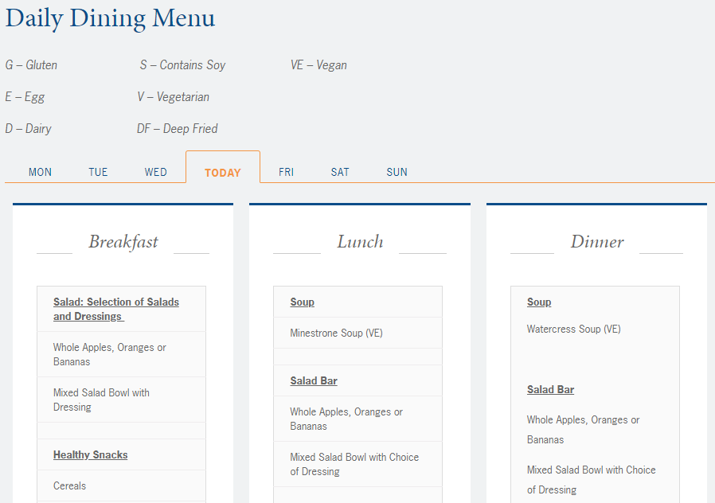
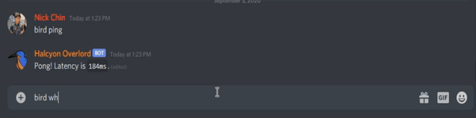
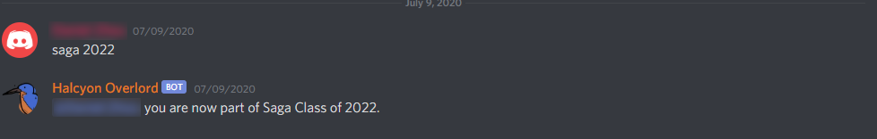

# ync-bot
Discord bot for Yale-NUS College Discord server

## About this project
This bot is created for the student-run Yale-NUS College [Discord](https://discord.com/) server. The server was created as a space for students to interact, share, and play video games with the community. The bot was created to manage community specific functions, such as displaying the cafeteria menu on a scheduled basis, or reply in colloquial directions of room/building locations within the campus. All of the functionality here was produced within a week.

Note that this repo is meant for archival purposes. The bot is hosted on a Heroku server, running 24/7. As an archival repo, this will serve as a point of learning/documentation. Under this section will include implementation choices, mistakes, and learning points.

## Features
Here is a list of features that the bot provides.
* Scheduled cafeteria/dining hall menu updates
  * Sends updates 20 minutes before meal times
* Colloquial direction/location response
  * Ask the bot a location within campus and it will reply general, easy-to-understand directions
* Produces campus map
* Sets permission roles for each user
  * Roles are used by Discord and the server admin
  * Roles determine read/write permissoins for each user on any text/voice channel
* Produces a form for users to fill out to make server-wide announcements
  * Parses through the input into a standardized format
  * Makes announcement on behalf of users (to reduce notification spam)
  
## Implementation
The Discord bot is implemented using Node.js and the [discord.js](https://discord.js.org/#/) library. The library provides a very accessible method of interacting with the Discord API. Node.js was chosen as various npm libraries became very useful.

The next section will discuss each feature, their implementation choices, and any mistakes/learning points that could be improved on.

### Connecting to Discord
Discord bots require permissions through an API key for authentication. In efforts to maintain privacy of keys, all tokens are kept in a `.env` file. This is accessed and loaded into the environment during runtime.

### Interacting with the bot
The bot is designed to respond to chat messages. To distinguish when the bot should respond, messages towards the bot are prefixed with the command `bird`. For example, to inquire about the location of classroom 3, a user would write:
```
bird where cr3
```

### Menu Updates
The cafeteria/dining hall menu updates sources the information from the college's website. The website contains a page dedicated to serving the menu for all 3 meals for each day of the week. A snippet of the menu can be seen below.



Since the website does not have an API to access its information, retrieving the information is performed through data scraping. [Cheerio](https://www.npmjs.com/package/cheerio) library was used to access and scrape data through HTML. The function `getMenu()` within [index.js](index.js) was used to access the website and print out the contents of the menu each time. Since there are 3 different meals for each day, a [Cron](https://www.npmjs.com/package/cron) job was scheduled to output the menu 20 minutes before each meal on every day.

The challenging areas of scraping the data was dealing with the formatting. Normally, the data would be presented in the same exact format. At a period of time, a different format was used temporarily, which broke the bot as no data was retrieved due to differing HTML tags. As a temporary fix, the function was adjusted to work with the temporary format. Another challenging portion was message length limits. Discord has a 2000 character limit on each message, so particularly long menus would not fit within a single message. As a design choice, if any message was too long, a link to the website would be in the body of the message instead. Ideally, multiple messages would be sent to break up the menu into sendable parts, but due to time constraints and readability issues, this was never implemented. To further improve this functionality, the bot should be able to detect where and when to break up a message into digestable parts.

### Colloquial Directions
Finding locations/classrooms can be challenging for those new to the college. Some students don't normally visit various parts of the campus due to their residential suite locations and class locations. To remedy any confusion about navigation, the bot will respond general directions to a location in the college. When giving directions in real life, people normally give directions such as "left of {some building}" or "it's right beside {some classroom}". As such, the bot will respond with a relative location in reference to different parts of the campus. As all students are familiar with each residential college, most directional responses are in reference to each of the residential quarters.



Normally, it would be advisable to separate the location and responses into a lookup table, possibly a database that would hold each location. A database would be better as it wouldn't require hardcoding directions/locations. However, Yale-NUS College campus is very small, so it was much easier and quicker to hardcode each location. Since locations dont change very often, this became the quickest and easiest solution in the long run. If this bot was adapted to a larger space, a database with queries to each location would be more sensible.

### Setting Permissions
Setting permissions through roles is the standard way of managing a Discord server without manual content filtering. The server is designed such that only those with certain roles can access certain voice and text channels. Without roles, anyone can create an account and spam messages.



Assigning roles to each user is done though a text pattern. The server consists of 2 main types of roles, one that distinguishes which residential college one belongs to, and the other to distinguish graduating year. The bot will assign roles according to responses that match the pattern `<residential college> <graduating year>`. An additional role would be assigned automatically to alumni of the college (done on a scheduled basis via Cron).

### Server-wide Announcements
The idea of the Discord server was to take advantage of the various text channels and dedicate each one to a specific topic. As of time of writing, communications throughout the community exist through various Facebook groups. One group is dedicated to community events/announcements, another is dedicated to lost and found items. There are at least 6 or 7 different groups for each topic. To take advantage of the Discord channels without losing the functionality of making big public posts like Facebook, the bot is designed to make an announcment to all users, which is generated from a text based form through a direct message with the bot.

The biggest issue with this feature was the demand. No one used this feature so it was cut from the production bot. The code still exists, but is commented out in the Heroku server. Something that could be improved on was code readability. Currently the function uses `send().then` to wait for responses from users. However, this caused lots of indented lines, which became very hard to read. The use of `async()` would vastly improve the readability.

## Final Thoughts
This project ended up being incredibly hacky and was definitely rushed due to the deployment goal of 1 week. Design and implementation could have definitely been improved on. When it comes to the deployment realm, the demand for certain functionality for users determined the longevity of the bot and further development. As of time of writing, the bot still functions with most of the above features still enabled. Due to time constraints and user base, it's likely the bot would no longer be updated.
